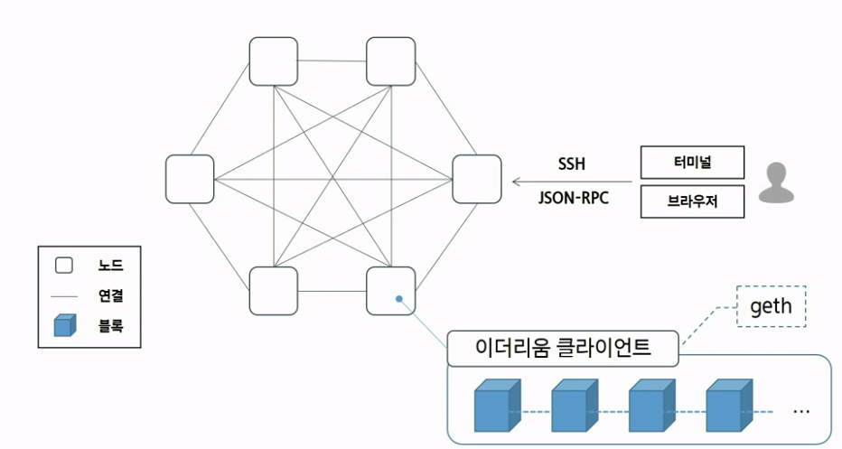

##블록체인 네트워크의 이해 : 프라이빗 네트워크 실습으로 이더리움 네트워크 시작하기

####이더리움(ethereum)이란...?
이더리움은 블록체인 기술을 기반으로 스마트 계약 기능을 구현하기 위한 분산 컴퓨팅 플랫폼이자 운영체제

####이더리움 블록체인 네트워크의 분류
- 프라이빗 네트워크 : 로컬 PC 또는 친구들끼리 이더리움을 구동하는 것을 의미 (마음껏 채굴, 배포 가능)  
- 퍼블릭 네트워크 : 전세계 사람들이 동일한 데이터를 유지하고 있는 네트워크 (데이터가 불가역적으로 저장)  
  - 메인넷  
  - 테스트넷 ex) _롭슨 Ropsten_, 코반 Kovan, 링키비 Rinkeby, 고얼리 Goerli

####이더리움 네트워크 개념도
  
- 기본적으로 블록체인은 다수의 노드로 구성되는 것이 원칙 (로컬 PC는 노드가 한 개)  
- 노드는 다양한 데이터를 동기화시켜서 블록의 형태로 가지고 있음
- 이더리움에 참여하기 위해서는 이더리움 클라이언트를 활용해야함 -> geth를 많이 사용

####환경설정
1. Chocolatey 설치 with Windows PowerShell 관리자 권한
https://chocolatey.org/install
```
Set-ExecutionPolicy Bypass -Scope Process -Force; [System.Net.ServicePointManager]::SecurityProtocol = [System.Net.ServicePointManager]::SecurityProtocol -bor 3072; iex ((New-Object System.Net.WebClient).DownloadString('https://community.chocolatey.org/install.ps1'))
```

2. 사전 필요 요소 설치 with Windows PowerShell 관리자 권한
```
> choco install git -y
> choco install golang -y
# geth가 go 언어로 되어있으므로 설치해야함
> choco install mingw -y
> choco install nodejs-lts 
# node.js 설치
```

3. Geth 설치 with 명령 프롬포트
```
> mkdir src\github.com\ethereum
> git clone https://github.com/ethereum/go-ethereum --branch v1.9.24 src\github.com\ethereum\go-ethereum
# go-ethereum == geth
> cd src\github.com\ethereum\go-ethereum
> go get -u -v golang.org/x/net/context
# 컴파일
> go install -v ./cmd/...
> geth version
```

4. 가나슈 설치 with 명령 프롬포트 
```
> npm install -g ganache-cli
> ganache-cli --version
```

5. 지갑 프로그램(Metamask) 설치 with 크롬 확장 프로그램
https://metamask.io/

####로컬 네트워크 활용 및 실습
1. 가나슈 구동 : 가나슈를 사용하면 PC가 마치 이더리움 네트워크인 것처럼 개발 가능
######로컬 테스트넷 구동 : 프라이빗 로컬 네트워크가 구성되었다.
```
> ganache-cli -d -m -p 7545 -a 5
```
- -d -m (-deterministic --mnemonic) HD Wallet 생성시 니모닉 구문 사용
- -p(--port) 포트 지정 (default 8545)
- -a(--account) 구동 시 생성할 계정 수 (default 10)

######명령어 옵션 확인
```
> ganache-cli --help
```

2. Geth로 네트워크에 접속 -> geth 명령어로 가나슈 테스트넷에 접속 with 새 명령 프롬포트
```
> cd src\github.com\ethereum\go-ethereum
> geth attach http://localhost:7545
```

3. 네트워크 기본 사항 확인
######연결성 확인 Connectivity Check
```
> net.listening
> net.peerCount
```
######계정 목록 확인
```
> eth.accounts
```
######계정 보유 잔액 확인
```
> web3.fromWei(eth.getBalance(eth.accounts[0]))
```
######체인 ID 확인
```
> eth.chainId()
```

4. 네트워크 정보 입력  
메타마스크(크롬) -> 맞춤형 RPC에서 정보 입력

5. 메타마스크 계정으로 이더 전송
######geth consol로 진행
```
> tx = {from: "가나슈 제공 계정 중 하나", to: "메타마스크 계정", value: 1e18}
# tx = {from: "0x90f8bf6a479f320ead074411a4b0e7944ea8c9c1", to: "0x8419957CAFDBaEDbb05d8a689BE931AF85c3431b", value: 1e18}
> eth.sendTransaction(tx)
# 이 트랜잭션을 보내라!
```
-> METAMASK의 지갑에서 송금이 된 것을 확인할 수 있다.

6. from 주소 잔액 확인
```
> eth.getBalance(eth.accounts[0])
```
- (value + 소요 가스(수수료))만큼 차감 

7. 단위 환산
```
> web3.fromWei(eth.getBalance(eth.accounts[0]), "ether")
```
<hr>  

##HW1 : geth console에서 데이터를 담은 트랜잭션 생성하기
#####사전 준비
- 계정 목록 확인
```
> eth.accounts
```
- 계정의 잔액 확인
```
> eth.getBalance(ACCOUNT)
# eth.getBalance(eth.accounts[0])
```
#####트랜잭션 생성
- 트랜잭션은 이더리움의 상태(World State)를 변경시키는 역할
- 트랜잭션 메시지 생성
```
> data = web3.toHex("hello ethereum")
# 트랜잭션에 부가 입력을 하려면 hexadecimal character 형식을 사용
# 이를 지원하는 web3.toHex 함수 사용
```
- 트랜잭션 메시지 필드
```
> tx = {from: FROM_ADDRESS, to: TO_ADDRESS, data: data} 
# tx = {from: "0x90f8bf6a479f320ead074411a4b0e7944ea8c9c1", to: "0x8419957CAFDBaEDbb05d8a689BE931AF85c3431b", data: "0x68656c6c6f20657468657265756d"}
```
- from : 보내는 주소 계정 (optional)
- to : 받는 주소
- data : 메시지를 담을 수 있는 데이터 필드 (optional,hexadecimal character)
#####트랜잭션 전송
```
> tx_hash = eth.sendTransaction(tx)
```
- sendTransaction API를 통해 트랜잭션 메시지의 signature(from 주소의 개인키를 이용한 전자 서명 생성)가 생성되고 블록체인 네트워크로 전송
- 트랜잭션 전송 결과로 트랜잭션 고유의 해시 값이 반환
- 이 값을 통해 트랜잭션 상태를 조회할 수 있음
#####트랜잭션 조회
- 트랜잭션 조회
```
> tx_detail = eth.getTransaction(tx_hash)
```
- 트랜잭션 필드
>	- input : 생성된 트랜잭션의 입력 값
>	- blockHash, blockNumber : 트랜잭션이 완결되면 (블록에 담겨서 처리가 됨) 유효한 값 생성
>	- gas : 트랜잭션이 소요할 수 있는 최대 가스 카운트 (gas limit)
>	- nonce : 보낸 주소(from)로부터 생성된 트랜잭션의 순차적 수 (PoW의 nonce와 구분하기 위해 Transaction nonce라고도 함.)
>	- v, r, s : ECDSA(Ellipstic Curve Digital Signature)의 구성요소. 전자 서명을 검증하기 위한 값, 전자 서명을 생성하기 위한 입력 값 정보를 포함
#####트랜잭션 결과 확인
- 트랜잭션 input 필드 검사
```
> web3.toAscii(tx_detail.input)
# hexadecimal character로 저장된 값을 Ascii 값으로 변환해야 한다.
# 이를 위해 web3.toAscii 함수를 이용
```
- 보낸 주소의 계정 잔액 확인
```
> balance = eth.getBalance(from)
# balance = eth.getBalance("0x90f8bf6a479f320ead074411a4b0e7944ea8c9c1")
> web3.fromWei(balance, "ether")
```  

##HW2 : essay  

##HW3 : Ropsten 테스트넷 동기화
######동기화 폴더 생성
######계정 생성
- Geth 명령어로 계정 생성
```
> geth --datadir .\datadir\ account new
```
######Ropsten Faucet에서 이더받기  
https://faucet.ropsten.be/
######동기화를 위한 포트 허용
- 방화벽 열기 : tcp 30303, udp 30303 
######롭슨 테스트넷에 참여하기
```
> geth --ropsten --datadir C:\Users\multicampus\workspace\datadir --http --http.addr 0.0.0.0 --http.api eth,net,web3,personal --http.corsdomain * --allow-insecure-unlock
```
######동기화 상태 확인
- Geth 접속
```
> geth attach http://localhost:8545
```
- 상태 확인 명령
```
# geth console 내부
> net.listening
> eth.syncing
> net.peerCount
> eth.syncing.currentBlock / eth.syncing.highestBlock * 100
```
######동기화 완료 확인
- 이더 잔고 확인
```
> eth.getBalance(eth.accounts[0])
```