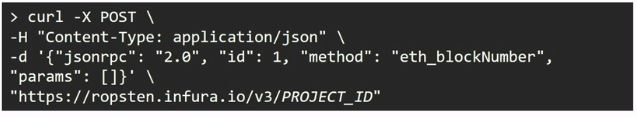

## 블록체인 네트워크의 이해 : 퍼블릭 블록체인 실습

#### 지갑을 통해 네트워크 활용하기
1. 메타마스크와 노드 연결
- 메타마스크 연결
- 메타마스크 Ropsten 네트워크에 연결하기
2. 계정 등록하기
- 키스토어 가져오기(import)
- Ropsten Faucet으로부터 이더를 수령한 계정
3. 메타마스크로 트랜잭션 생성하기
- 메타마스크에서 다른 계정을 0.1Ether 전송
- 메타마스크에서 계정 추가
- geth console에서 새로운 계정 생성 (예시는 PowerShell 관리자모드)
```
> personal.newAccount(PASSWORD)
```
- 메타마스크에서 다른 계정으로 0.1Ether 전송
- 받은 계정의 잔액 확인하기
>	- 메타마스크에서 계정 가져오기로 확인
>	- geth console에서 새로운 계정을 생성한 경우, 잔액 확인의 예
```
> eth.getBalance(eth.accounts[1])
> web3.fromWei(eth.getBalance(eth.accounts[1]), "ether")
```  

#### 노드 서비스로 네트워크 활용하기
1. 노드 서비스 가입하기
- https://infura.io/
- 프로젝트 페이지 > SETTINGS
- ENDPOINT를 Ropsten으로 변경 : Infura Project에서 생성된 ENDPOINT는 고정된 값으로 이후 과정에서 이를 이용하기 위해 URL을 기록해둘 것을 권장
# https://ropsten.infura.io/v3/5c293307f9444b55a3f606f73d580ae8
2. 노드 서비스 이용하기
- 노드 클라이언트 조회 with cmd  
  

#### 노드로 직접 참여하기
1. 네트워크 동기화 완료 확인
- 이더 잔고 확인
```
> eth.getBalance(eth.accounts[0])
# 동기화가 완료되어야만 1,000,000,000,000,000,000(=1X10^18)이 출력됨.
# 기본 단위는 Wei(웨이), 1 Ether = 10^18Wei
```
2. geth console 이용하기
###### 연결성 확인
###### 계정 생성
###### 트랜잭션 생성
- 트랜잭션 생성을 위한 계정 보안 해제 (Unlock)
```
> personal.unlockAccount(eth.accounts[0])
```
- 트랜잭션 오브젝트 구조
```
> tx = {from: eth.accounts[0], to: eth.accounts[1], value: 1e17, gas: 90e3, gasPrice: 20e9, nonce: 0}
```
- 트랜잭션 보내기
```
> eth.sendTransaction(tx)
```  

#### HW1 : geth를 통해 데이터를 담은 트랜잭션 생성하기

#### HW2 : geth의 또 다른 API를 사용하여 트랜잭션 보내기

#### HW3 : 노드 서비스에 조회 요청 보내기

#### HW4 : 노드 서비스를 통해 트랜잭션 보내기

#### HW5 : 네트워크 사용 방법의 장단점 비교하기
